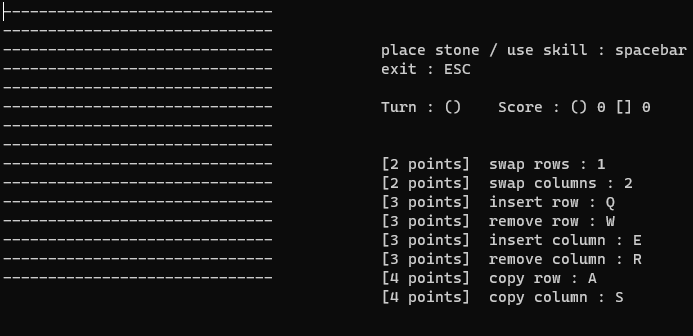

# Gomoku magic game

## This games is based on Gomoku. Gomoku is traditionally played wtih Go pieces on 15x15 size board. The rule of Gomoku follows as:  
Players are always two people. Each player uses repectively black and white stone. Players take turns placing their stones one by one on empty spaces on the board. The goal of the game is to connect 5 stones seamlessly horizontally, vertically, or diagonally.  
## However, instead of black and white stones, players in Gomoku magic game use () and [] symbols and earn points by seamlessly connecting five or more stones.  
For example,  
* +1 point if 5 stones are connected  
* +2 points if 6 stones are connected  
* +3 points if 7 stones are connected  
* etc...  

Also, players can use skills if they have enough points. Skills can be used to rearrange a player's sones to his/her advantage or to disrupt another player's stones:
* Swap rows/columns (-2 points)  
* Insert blank rows/columns wherever desired (-3 points)  
* Remove row/column (-3 points)  
* Copy rows/columns (-4 points)  

Each time a player uses a special skill, a number of points decrease as indicated above. Players who do not have enough points cannot use special skills. Connecting stones from using skills does not increase the player's points. The size of the board can change due to some skills. The minimum board size is 10 x 10 and the maximum size is 20 x 20. Once the board reaches 10 x 10, using skills will no longer shrink it. Similarly, boards that become 20 x 20 do not increase in size due to skills.

<figure align="center">
        
    <figcaption align="center">demonstration: start image</figcaption>
</figure>